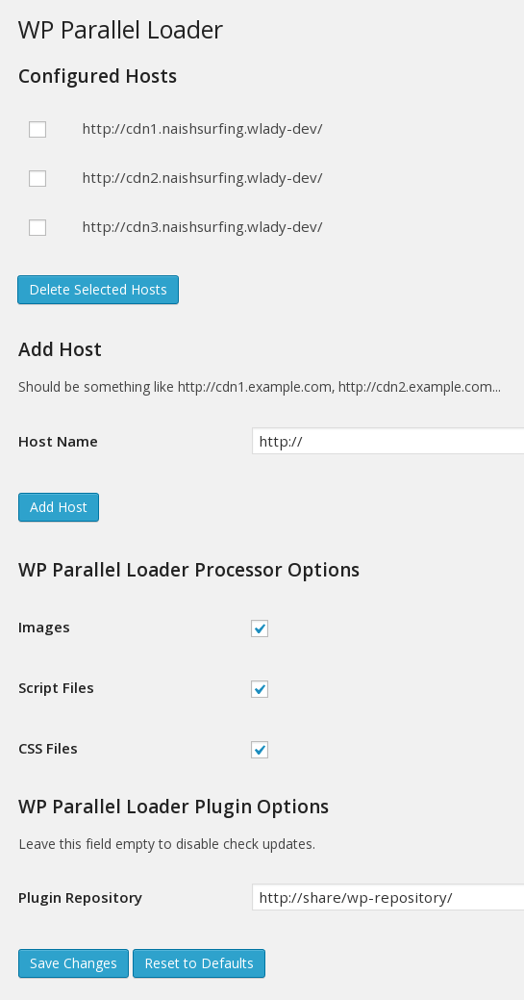
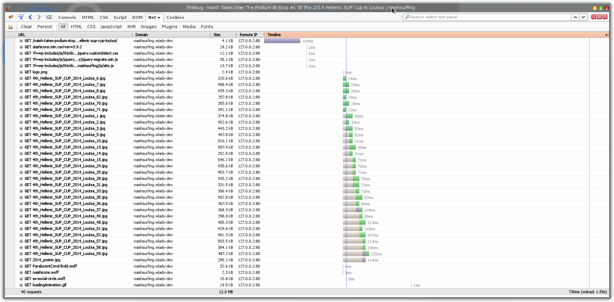
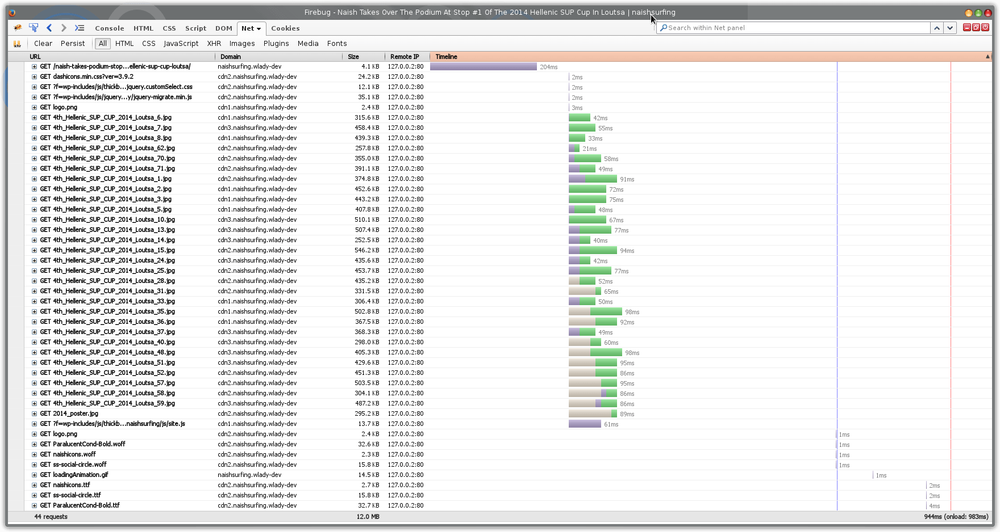

# WP Parallel Loader Plugin

The WP Parallel Loader plugin reduces page loading time by substituting the original resource URLs with configured hostnames to parallelize downloads across them. [Read more](http://gtmetrix.com/parallelize-downloads-across-hostnames.html)

Substitution is turned off if:
  - URL starts with double slashes. E.g
    
```sh
<script src="//libs/angular.js"></script>
```
  - URL contains template variable. E.g
```sh    
<script src="{$domain}/libs/angular.js"></script>
<script src="${domain}/libs/angular.js"></script>
<script src="{{domain}}/libs/angular.js"></script>
```
  - External URL is in FQDN format

### Installation

1. Upload `wp-parallel-loader.php` to the `/wp-content/plugins/` directory
2. Activate the plugin through the 'Plugins' menu in WordPress
3. Configure the hostnames and types of processed resources

### Screenshots






